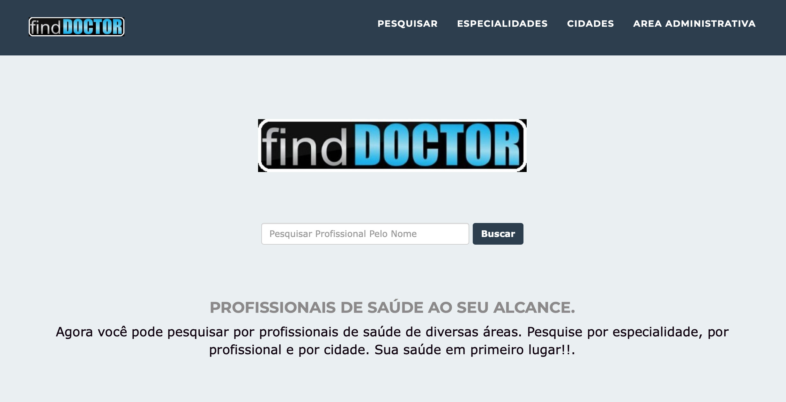
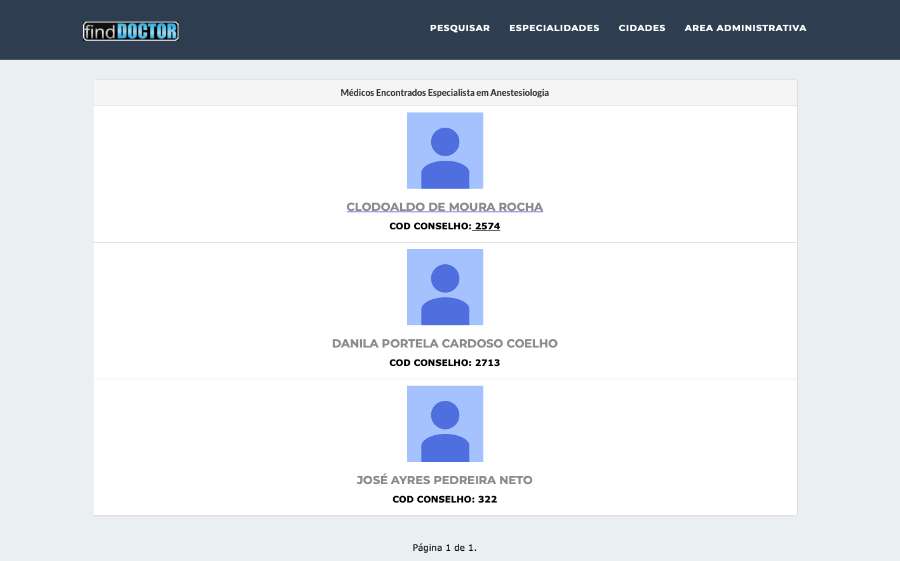
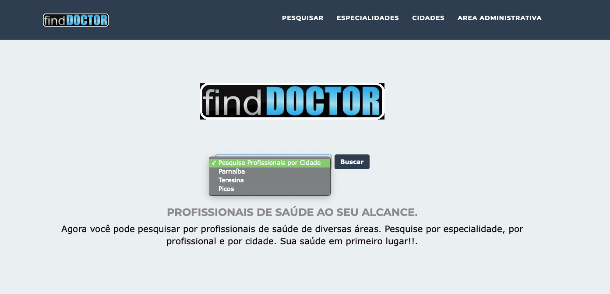
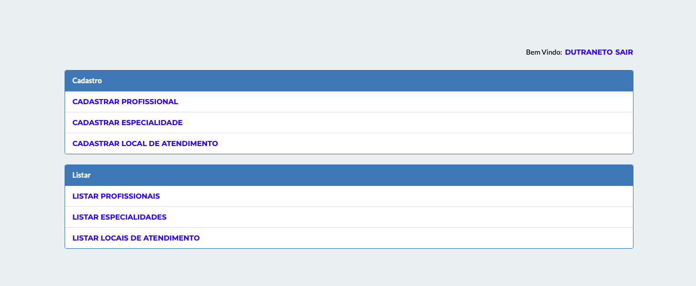
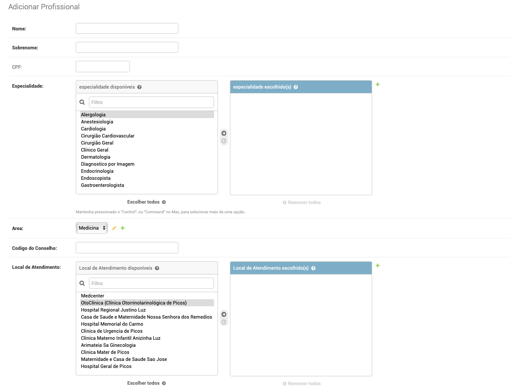
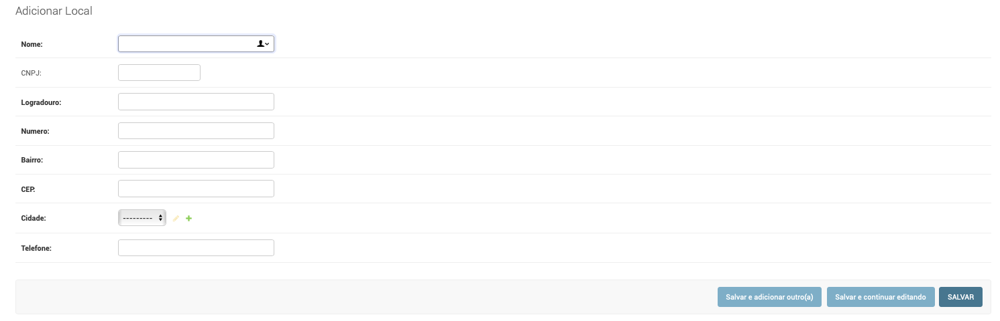
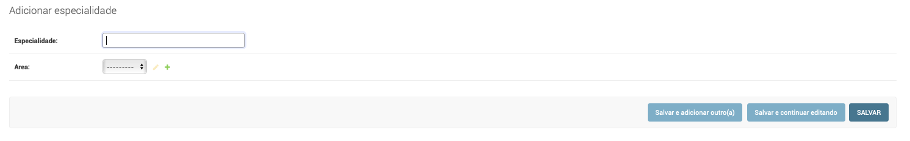
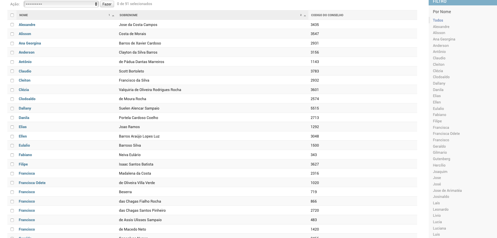
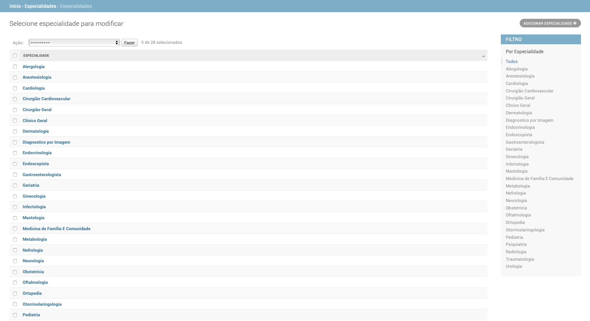
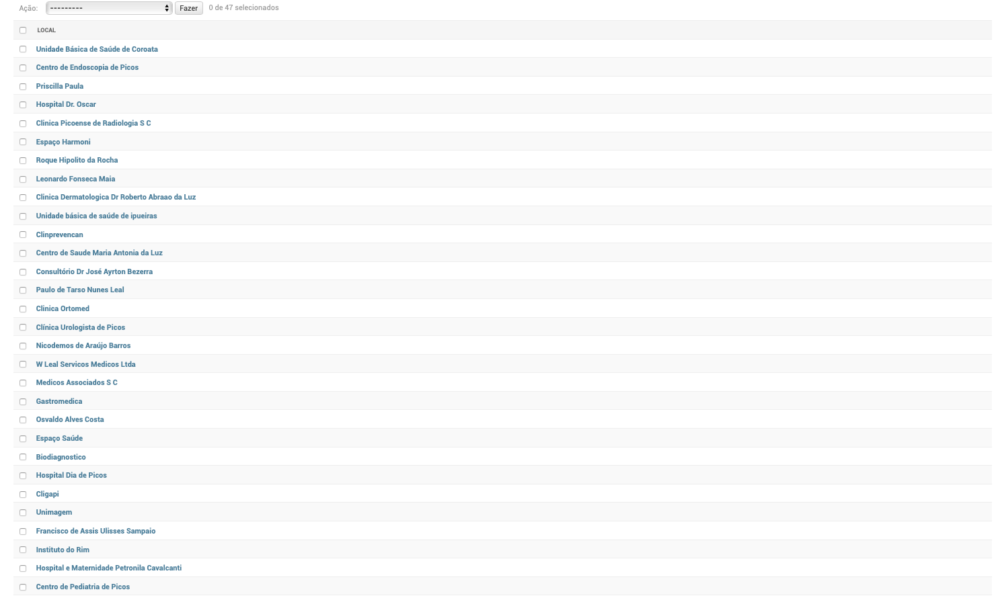

# FindDoctor

---

###### A Python Backend App integrated with Django Framework allowing patients to search for doctors, clinics and medical specialities in a given region.

###### Projeto do curso de Gestão de Projetos ADS-V IFPI-PI 2016.1

---

### Back-end

-   Django Version: 1.9.8
-   Python Version: 3.5.0

---

### Front-end

-   HTML
-   avaScript (jQuery)
-   CSS
-   Responsive Design
-   Bootstrap

---

### CI

-   Heroku.com

---

## Live Demo

### https://finddoctor.herokuapp.com

---

### Screenshots

